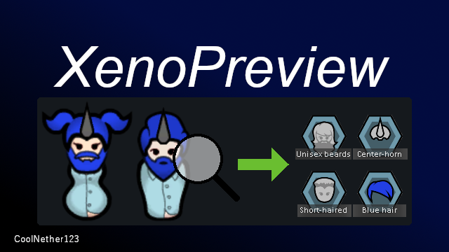

Portions of the materials used to create this content/mod are trademarks and/or copyrighted works of Ludeon Studios Inc. All rights reserved by Ludeon. This content/mod is not official and is not endorsed by Ludeon. 

# XenoPreview

Supports RimWorld 1.6, 1.5, and 1.4.

XenoPreview adds a live preview window to the xenotype creation screen. The
female and male previews update as you select genes. You can lock either pawn,
reroll or rotate them separately, hide their clothes, and minimize the window.
With Ideology active, you can also show or hide tattoos.

The mod stores no data in your saves, so you can add or remove it during a
playthrough.

## Latest release

Version 1.5.1 adds optional SpineLib integration, saved settings, and Alt-click
navigation from the preview window to the matching settings. XenoPreview loads
its standalone version when SpineLib is not installed.

## Known issues

No known issues.

## Original idea credit

The original idea came from this
[RimWorld Discord discussion](https://discord.com/channels/214523379766525963/1372022155193225226).

## DLC and mod compatibility

Biotech is required. The other official expansions are supported but optional.

### Official DLC

- [Biotech](https://rimworldgame.com/biotech/): required
- [Royalty](https://rimworldgame.com/royalty/): supported
- [Ideology](https://rimworldgame.com/ideology/): enables tattoo previews
- [Anomaly](https://rimworldgame.com/anomaly/): supported
- Odyssey: supported

### Mods

[Xenotype and Ideology Buttons TitleScreen](https://steamcommunity.com/sharedfiles/filedetails/?id=3243233522)
has native compatibility, contributed by _Sumarbrander.

Other mods are expected to work unless they replace the same xenotype-creation
UI. Report compatibility problems on the mod page.

## Links and resources

[GitHub Repository](https://github.com/coolnether123/XenoPreview)

## Support the developer

If you want to support development or help cover DLC used for compatibility
testing, you can [buy me a coffee](https://buymeacoffee.com/coolnether123).
