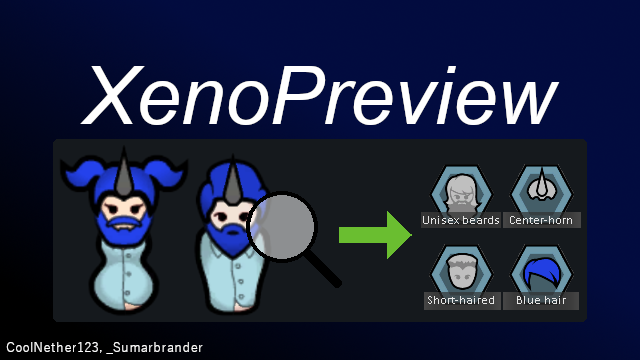

Portions of the materials used to create this content/mod are trademarks and/or copyrighted works of Ludeon Studios Inc. All rights reserved by Ludeon. This content/mod is not official and is not endorsed by Ludeon. 

# XenoPreview

Supports RimWorld 1.6, 1.5, and 1.4

XenoPreview adds a dynamic live preview window to the xenotype creation screen. As you select genes, instantly see exactly how your custom xenotypes will appear in-game. Each gender has an individual lock feature, allowing separate rerolls and rotation to help you achieve the perfect appearance. You can also toggle apparel and tattoos (tattoos enabled when Ideology DLC is active) for a clearer view, and minimize the preview window when not needed.

This mod is fully safe to add or remove from your saves at any point without any risk of issues.

## Known Issues

None at this time.

## Original Idea Credit

This mod's concept was originally suggested on the RimWorld Discord:
[RimWorld Discord Channel](https://discord.com/channels/214523379766525963/1372022155193225226)

## DLC and Mod Compatibility

XenoPreview is compatible with all official RimWorld DLC and most mods that interact with the xenotype creation interface.

### Official DLC
[Biotech](https://rimworldgame.com/biotech/) - Required
[Royalty](https://rimworldgame.com/royalty/) – Supported
[Ideology](https://rimworldgame.com/ideology/) - Enables tattoo preview functionality
[Anomaly](https://rimworldgame.com/anomaly/) – Supported

### Mods

[Xenotype and Ideology Buttons TitleScreen](https://steamcommunity.com/sharedfiles/filedetails/?id=3243233522) – Native - Thank you _Sumarbrander!
Generally compatible unless explicitly stated otherwise. Please report any compatibility issues directly on the mod page.

## Links and Resources

[GitHub Repository](https://github.com/coolnether123/XenoPreview)

## Support the Developer

If you enjoy my mods and want to support my work, or help me acquire additional DLC for better mod compatibility, consider leaving a small tip here:
[Buy Me a Coffee](https://buymeacoffee.com/coolnether123)
